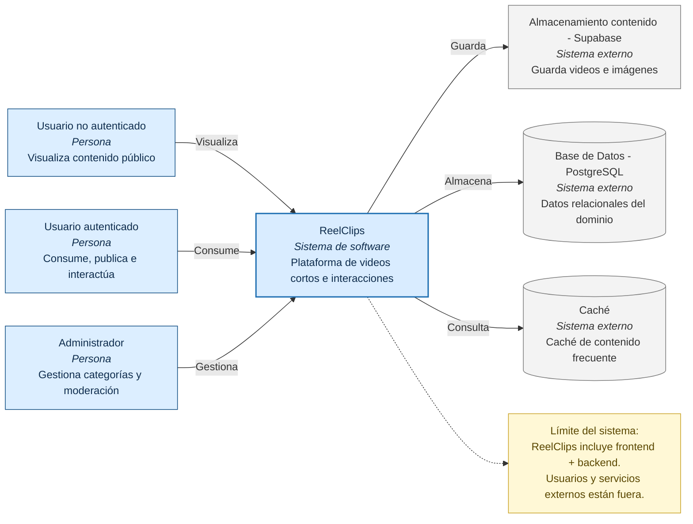

# C4 Nivel 1 - Context Diagram
 
Este diagrama muestra cómo los distintos tipos de usuarios interactúan con ReelClips y cómo el sistema se comunica con servicios externos como PostgreSQL y Supabase Storage.
 

 
---
 
## Descripción
 
### Personas
 
| Actor | Descripción |
|---|---|
| Usuario no autenticado | Puede visualizar contenido público dentro de la plataforma |
| Usuario autenticado | Puede consumir contenido, publicar reels e interactuar |
| Administrador | Gestiona categorías, moderación y administración del sistema |
 
### Sistema Principal
 
| Sistema | Descripción |
|---|---|
| ReelClips | Plataforma de videos cortos con funcionalidades sociales, feed, chat y gestión de contenido |
 
### Sistemas Externos
 
| Sistema | Responsabilidad |
|---|---|
| PostgreSQL | Persistencia de datos relacionales |
| Caché | Caché para optimizar consultas frecuentes |
| Supabase Storage | Almacenamiento multimedia de videos e imágenes |
