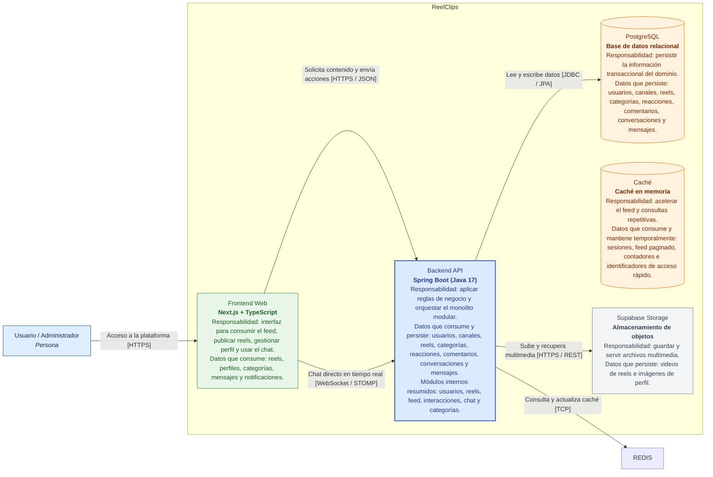

# C4 Nivel 2 - Container Diagram

Este diagrama muestra los principales contenedores que conforman ReelClips, incluyendo frontend, backend, persistencia y servicios externos. También representa los protocolos de comunicación, responsabilidades y datos consumidos o persistidos por cada contenedor.
 

 
---
 
# Descripción de Elementos
 
## Contenedores
 
| Contenedor | Tecnología | Responsabilidad | Datos que consume o persiste |
|---|---|---|---|
| Frontend Web | Next.js + TypeScript | Proporciona la interfaz gráfica de ReelClips | Consume reels, perfiles, categorías, mensajes y notificaciones |
| Backend API | Spring Boot + Java 17 | Aplica reglas de negocio y coordina el monolito modular | Consume y persiste usuarios, reels, comentarios, categorías, interacciones y chats |
| PostgreSQL | PostgreSQL | Persistencia relacional del dominio | Guarda usuarios, reels, categorías, comentarios, conversaciones y mensajes |
| Caché | Caché | Optimización mediante caché | Mantiene sesiones, feed paginado y consultas frecuentes |
| Supabase Storage | Supabase Storage | Almacenamiento multimedia externo | Guarda videos de reels e imágenes de perfil |
 
---
 
# Relaciones y Protocolos
 
| Desde | Hacia | Propósito | Protocolo |
|---|---|---|---|
| Usuario | Frontend Web | Acceso e interacción con la plataforma | HTTPS |
| Frontend Web | Backend API | Solicitudes de negocio y recuperación de datos | HTTPS / JSON |
| Frontend Web | Backend API | Mensajería en tiempo real | WebSocket / STOMP |
| Backend API | PostgreSQL | Persistencia transaccional | JDBC / JPA |
| Backend API | Redis | Caché y optimización de consultas | TCP |
| Backend API | Supabase Storage | Gestión de archivos multimedia | HTTPS / REST |
 
---
 
# Responsabilidades del Backend
 
El backend está organizado como un monolito modular compuesto por los siguientes módulos internos:
 
- Usuarios
- Reels
- Feed
- Interacciones
- Chat
- Categorías
 
Cada módulo mantiene responsabilidades separadas para reducir acoplamiento y mejorar mantenibilidad.
 
---
 
# Flujos Principales
 
## 1. Consumo de contenido
1. El usuario accede al frontend.
2. El frontend solicita el feed al backend.
3. El backend consulta PostgreSQL y Redis.
4. Los reels son recuperados desde Supabase Storage.
 
## 2. Publicación de reels
1. El usuario sube un video.
2. El backend valida tamaño y duración.
3. El archivo multimedia se almacena en Supabase.
4. Los metadatos se guardan en PostgreSQL.
 
## 3. Interacciones sociales
1. El usuario da like o comenta.
2. El backend registra la interacción.
3. Redis puede actualizar métricas temporales.
4. PostgreSQL persiste los cambios.
 
## 4. Chat en tiempo real
1. El usuario abre una conversación.
2. El frontend establece conexión WebSocket.
3. El backend procesa y distribuye mensajes.
4. El historial queda persistido en PostgreSQL.
